# Getting Setup on Windows
 These instructions are for Windows 10 - 64 bit.

## Install the Expo App on Your Phone
One reason Expo is such a great development environment is that it makes it easy to run and debug your mobile right on your phone. The Expo phone app makes that super easy.  The app requires a free Expo account.  Head over to the Expo web-site and  sign up for a free account.

1. Go to http://expo.io and click the "Create an account" button.

    

2. Install the Expo Client app on your phone. Search for it in your app store and install it.  It's free!

   

3. Launch the app and sign in using your Expo credentials. Your app in now linked to your account.


## Install Node on Your Computer

1. Download the Node installer here : https://nodejs.org/en/

2. Launch the installer.

    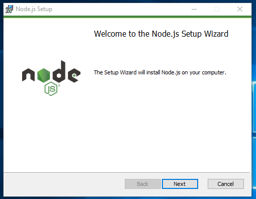


3. Click through the installer accepting all the default settings.

6. Verify that Node  is installed by opening a terminal and typing `node --version`  you should see version number for Git.

    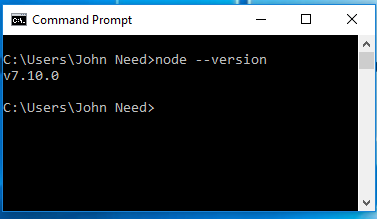


## Install and Configure Git

1. Download the Git installer here : https://git-scm.com/download/win

2. Launch the installer.

    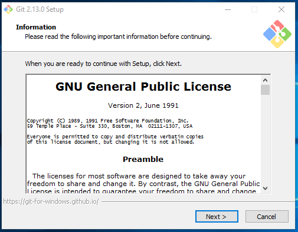

3. Click through the installer accepting all the default settings.

4. Verify that Git is installed by opening a terminal and typing
    ```cmd
    git --version
    ```
    You should see something like `git version 2.14.0.windows.1`

5. Set your name and email in Git using the following commands in the terminal.

    ```cmd
    git config --global user.name "YOUR NAME"
    git config --global user.email your.email@somecompany.com
    ```

## Install Python 2.7.15

We don't need Python to develop our apps, but it is required to publish our apps to the app store.

1. In the Command Prompt window, type the following and press Enter.

    ```cmd
    python
    ```

    If Python is installed and in your path, then this command will run python.exe and show you the version number.

    ` Python 2.7.4 (r264:75708, Oct 10 2009, 07:36:50) [MSC v.1500 64 bit (AMD64)] on win32 Type "help", "copyright", "credits" or "license" for further information.`

    Otherwise, you will see:

    `'python' is not recognized as an internal or external command, operable program or batch file.`

    If you don't have python 2.7, you need to download, install, and then add it to your path.

2. Start the process of downloading  and installing Python 2.7.15 for Windows by  going to this website:  https://www.python.org/downloads/release/python-2715

3. Find and download the Windows installer file that matches your system.

4. Open the file to start the installation wizard.

    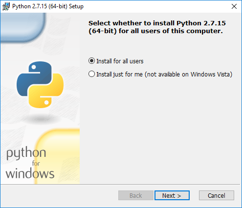

5. Click through the first screen to second and make a note of where Python is installed on your system.

    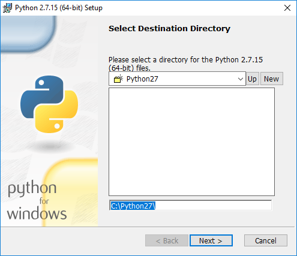

6. Continue through the wizard accepting the defaults.

7. We now need to add Python to your PATH environment variable so you can use it in the command line. In the Windows menu, search for and then select “advanced system settings."

8. In the window that appears, click Environment Variables… near the bottom right.

    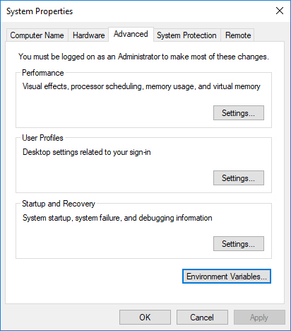

9. In the next window, find and select the user variable named Path and click Edit… to change its value. If you do not have a user variable named Path, click the New… button, then add it.

   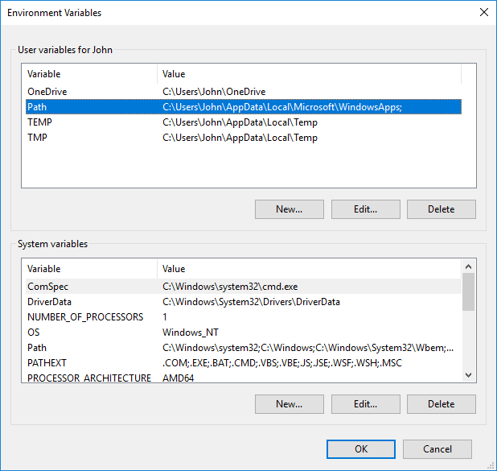

10. Select a new line and add the path you noted when you installed Python.  My path is "C:/Python27". Click OK to save this change. Click OK twice more to exit out of all the windows.

    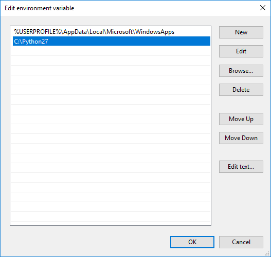

11. Confirm that you've added Python to your Path variable. Open a new command prompt and re-run the original command: `python`


## Install Firebase Tools

Before you can use the Firebase tools you'll need a free account.

1. Go to the Firebase website, https://firebase.google.com, and click the "Sign In" button. You'll be given the options of signing in or creating a new account.

2. Now that you have a free Google Developers account install Firebase Tools :
    ```bash
    npm install -g firebase-tools
    ```

## Install Expo


1. Install the expo development tools on your computer.
    ```bash
    npm install expo-cli --global
    ```

## Install Yarn    

You may be used to using npm to install node dependencies.  Expo recommends using Yarn.  It just works better with Expo.

1) In the terminal run 

    ```bash
    npm install -g yarn
    ```

## Install Visual Studio Code

You can you use any old text editor to write your code, but we recommend you use an IDE (Integrated Development Environment) that supports JavaScript.  It will make your life a lot easier.  Because it's free and works on Mac, Linux and Windows, and is pretty darn good we will be using Visual Studio Code for this course.

1. Download Visual Studio code by going to this website : https://code.visualstudio.com/download  Choose the .deb version and download it.

    

2. When the download is done, run the installer.


As of now you have all the tools you need to start creating awesome mobile apps. However you may want to test different your app on different phones.  The easiest way to do that is to install an Android emulator.  
Unfortunately you can't run iPhone emulators on anything but a Mac, but any code you write using Expo should run fine on iOS.  Continue with this tutorial to install the emulators.


## Install Android Studio
We won't be using Android Studio but installing it gives us features we need to debug our app.

1. Go to this page: https://developer.android.com/studio  and click the link to "Download Android Studio,"  accept the terms and conditions, and download the installer.

    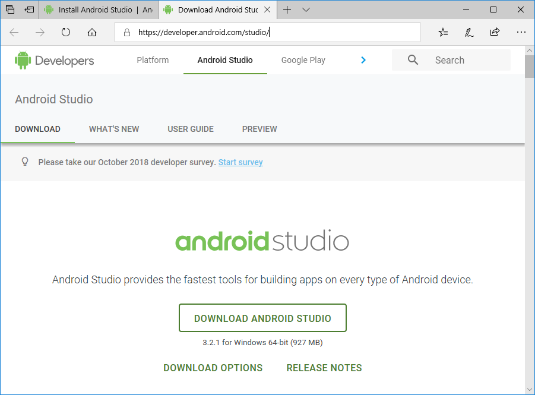

2. Accept the Terms then launch the installer.

3. Select whether you want to import previous Android Studio settings or not, then click "OK".

4. The Android Studio Setup Wizard guides you through the rest of the setup, which includes downloading Android SDK components that are required for development.


## Install and Configure Genymotion

Genymotion is the easiest way to get an Android emulator up and running.  With Expo, you can use your phone, but you're probably going to want to use a simulator.

1.  Go to the Genymotion "Fun-Zone" and create an account.  You'll need ti to download the "free for personal use" version of Genymotion :

https://www.genymotion.com/fun-zone/

2.  Once you have your account, go back to the website and download the "with VirtualBox" version. If you install the "without VirtualBox" version you'll need to install VirtualBox separately.

    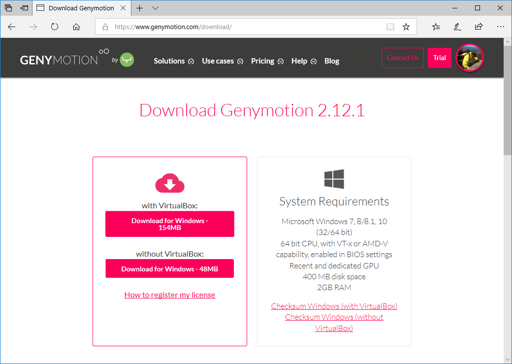

3. Run the installer.

4. Now we need to add an emulator (virtual device). Download a virtual device by launching Genymotion and clicking the "Add" button.

    

5. Select a virtual device (Google Pixel is a good choice) and click the "Next" button. You'll have a chance to rename the device if you don't like the default.

6. Test your installation by choosing the virtual device you just installed and click the "Start" button. Your emulator should start.

    

7. If you see the following window, It means you have Hyper-V activated.  Genymotion is incompantable with Hyper-V so you'll need to turn it off.

    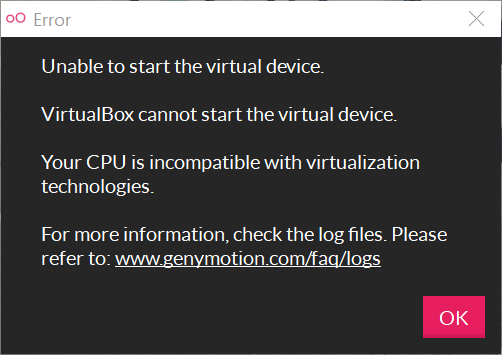

8. To deactivate Hyper-V open your control panel and select "Programs"

    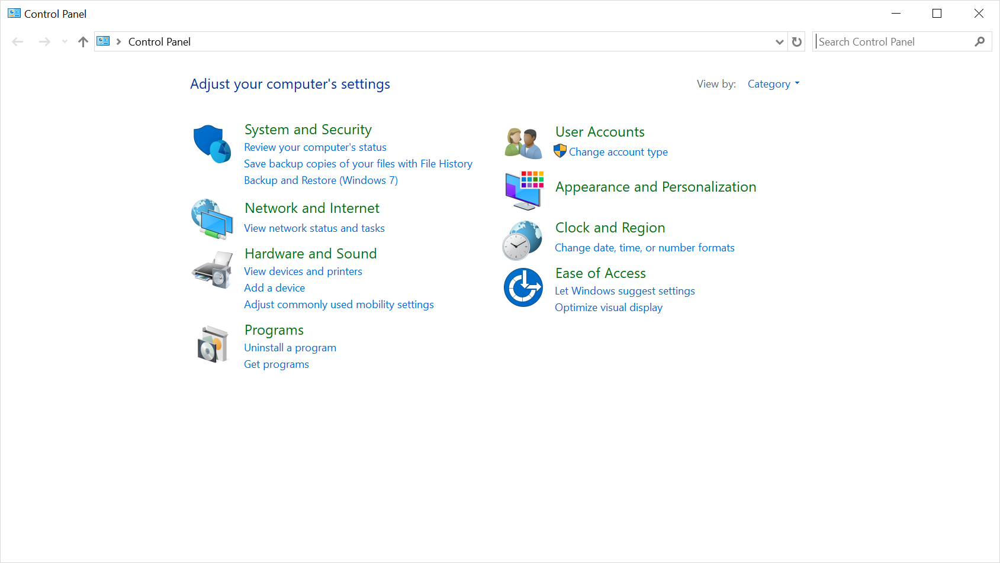

9. Under Programs and Features, select "Turn Windows features on of off"

    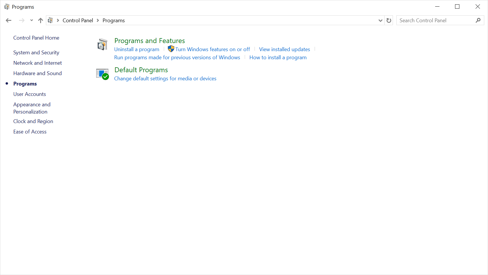

10. Remove the checkbox from the Hyper-V option. Restart your computer and try running an emulator again.

    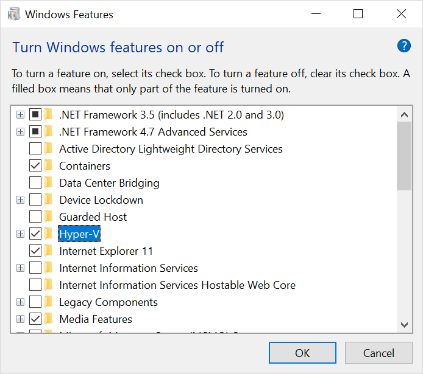

