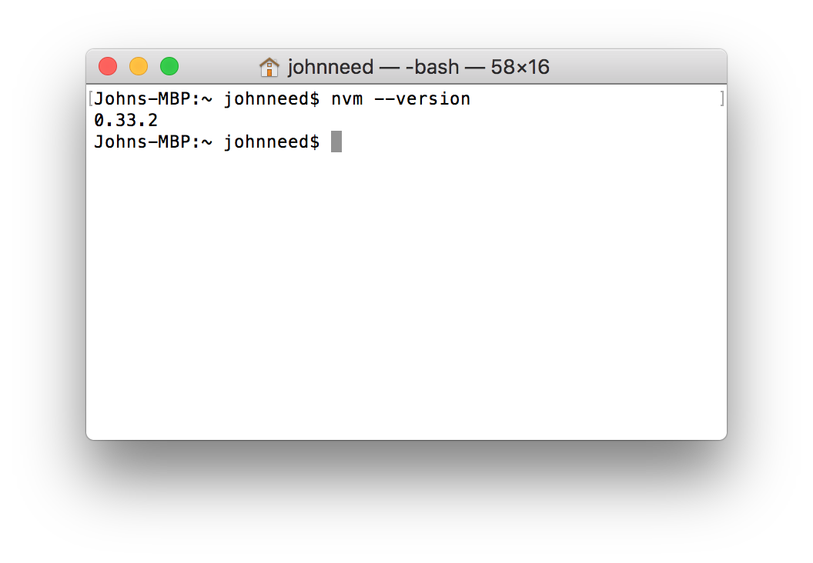
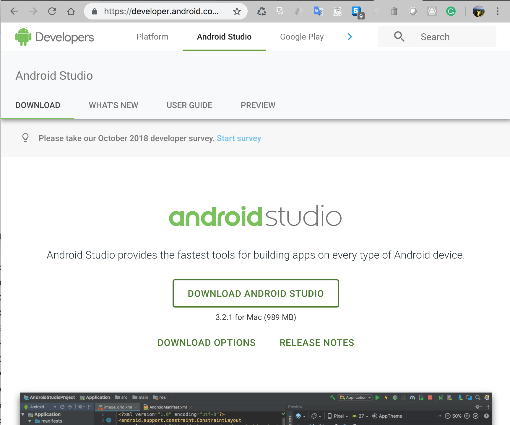
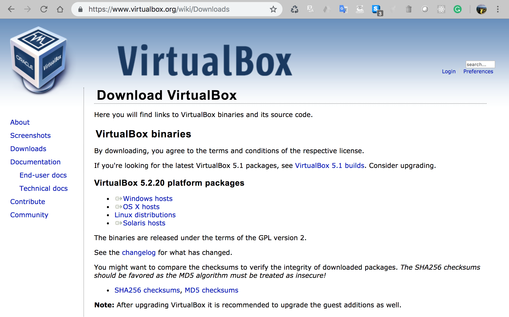
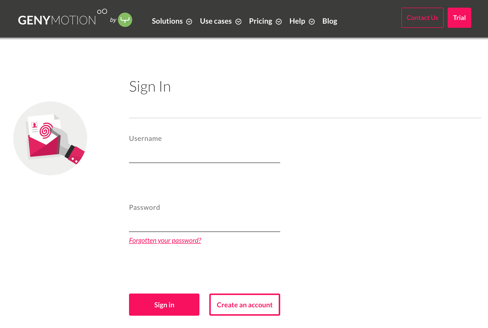
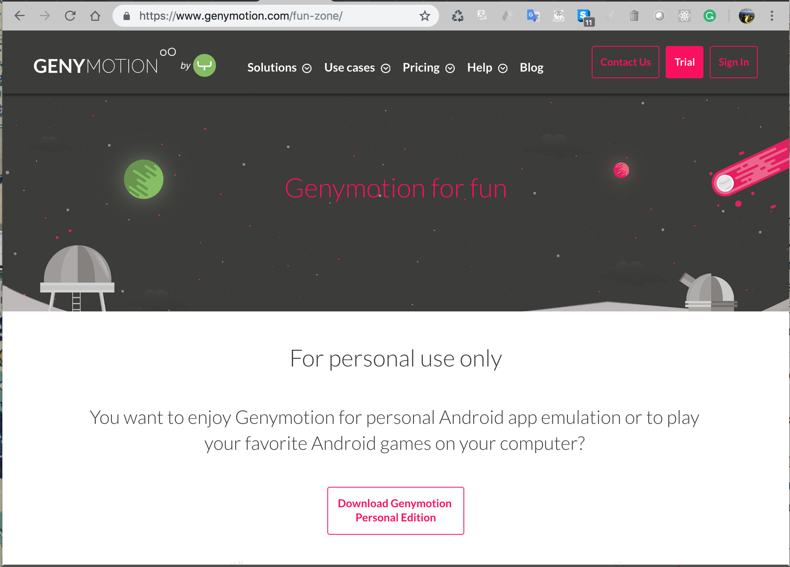
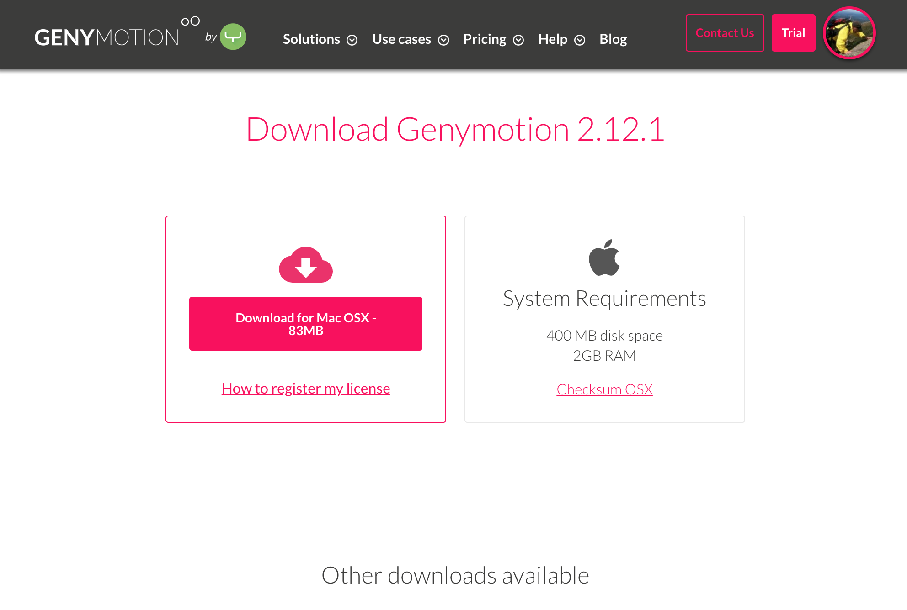
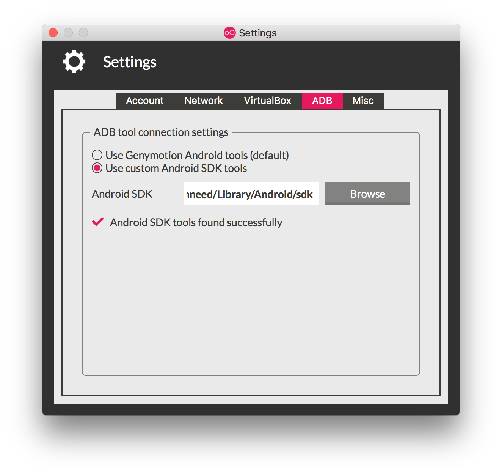
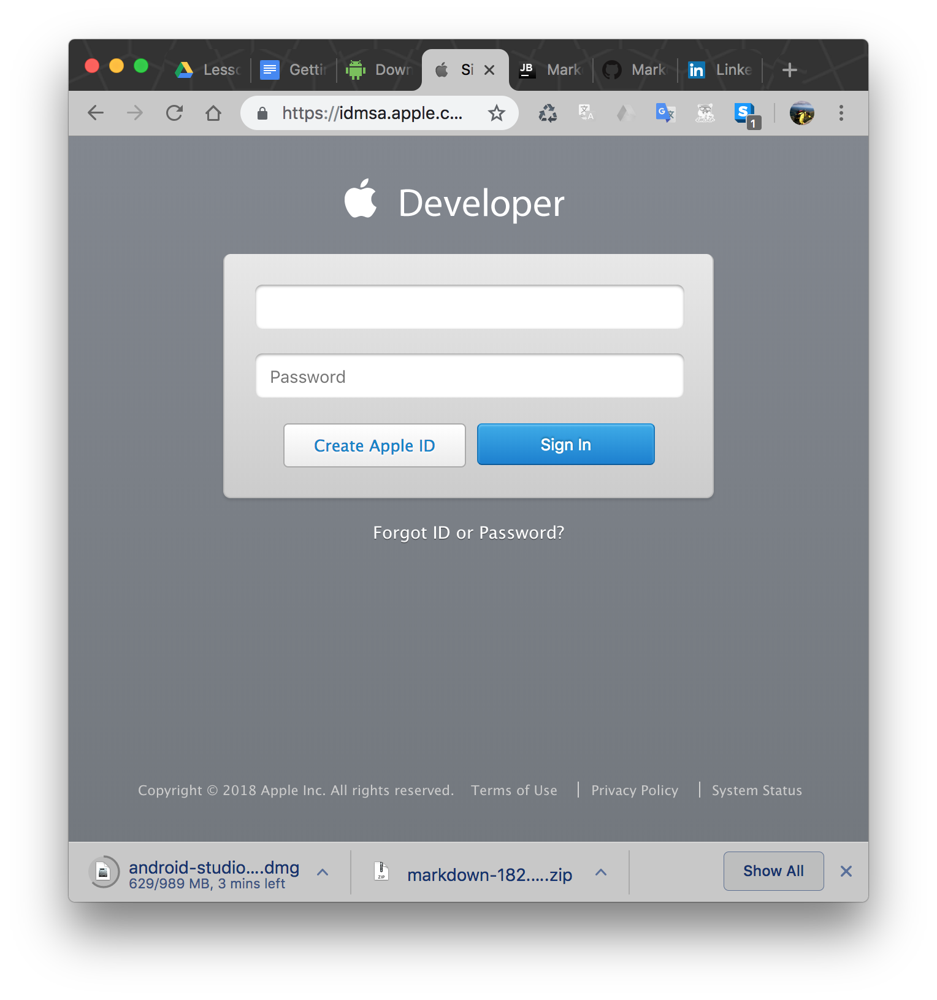
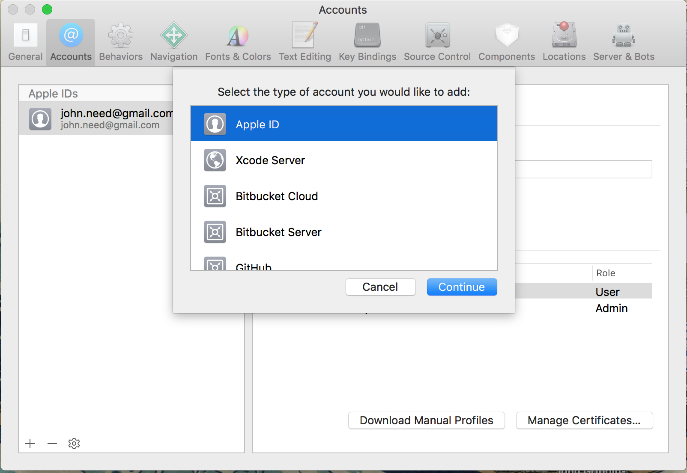
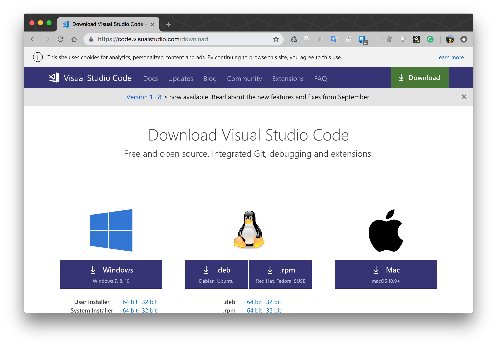

# Getting Setup on Mac

## Install the Expo App on Your Phone
One reason Expo is such a great development environment is that it makes it easy to run and debug your mobile right on your phone. The Expo phone app makes that super easy.  The app requires a free Expo account.  Head over to the Expo web-site and  sign up for a free account.

1. Go to http://expo.io and click the "Create an account" button.

    

2. Install the Expo Client app on your phone. Search for it in your app store and install it.  It's free!

   

3. Launch the app and sign in using your Expo credentials. Your app in now linked to your account.


## Install Node with NVM on Your Computer
The best way to install Node on a Mac is with Node Version Manager (NVM). NVM allows you to install multiple versions of Node making it easy to upgrade Node and switch versions when you have to.

1. Open a terminal and execute these two commands

    ```bash
    touch ~/.bash_profile
    curl -o- https://raw.githubusercontent.com/creationix/nvm/v0.32.1/install.sh | bash
    ```

2. Close and reopen the terminal. Then run this command to verify NVM was installed.
    ```bash
    nvm --version
    ```
    You should see the version number displayed.



3. You can now list all the versions of Node available for installation :
    ```bash
    nvm ls-remote
    ```

4. Install the latest version, by typing:
    ```bash
    nvm install < version number >
    ```

    

    I usually pick the latest version, but last long-term support  version is always safe should be listed as "Latest: LTS"

5. You can switch to any version you have by typing:
    ```bash
    nvm use < version number >
    ```

6. To make a version your default, run this command:
    ```bash
    nvm alias < version number > default
    ```

7. You can check the version of node you're running by typing :
    ```bash
    node -v
    ```

## Install Python 2.7.15

We don't need Python to develop our apps, but it is required to publish our apps to the app store.

1. You probably already have Python 2.7 installed. To verify this, open a terminal, type the following and press enter.
    ```bash
    python --version
    ```
    

2. If you don't see a version number like "Python 2.7.10"  then you'll need to install it.
    Go here: https://www.python.org/downloads/mac-osx/

3. Download and install the latest 2.7.X version of Python. Version 3.X is not the same thing. While it's okay to install 2.7 and 3 on the same machine, React Native requires 2.7 to build your project.


## Install and Configure Git
1. Download and install Git from this website : https://git-scm.com/download/mac

2. Set your name and email in Git using the following commands in the terminal.
    ```bash
    git config --global user.name "YOUR NAME"
    git config --global user.email your.email@somecompany.com
    ```

## Install Android Studio
We won't be using Android Studio but to get the features we need to debug our app, you still need to install it and run the app once.

1. Go to this page: https://developer.android.com/studio  and click the link to "Download Android Studio,"  accept the terms and conditions, and download the installer.

    

2. Accept the Terms then launch the installer.

3. If Android Studio was not run automatically, open the application from your Applications folder.

4. The Android Studio Setup Wizard guides you through the rest of the setup, which includes downloading the Android SDK components that we need for development.

  - **Note**: you can expect a permissions dialog to open during installation for the "Intel HAXM" installer.

## Install Virtual Box

With Expo, you can use your own phone to run and debug your app. Nonetheless having an emulator to test different phones is extremely useful. Genymotion and Virtual Box make configuring and running Android emulators quite easy.

1. Genymotion requires VirtualBox, a virtual machine engine from Oracle. Install it by downloading it from the Virtual Box website: https://www.virtualbox.org/wiki/Downloads

    

2. Choose the download for OS X hosts and install it.

## Install and Configure Genymotion

1. Genymotion requires you to create a free account. Go to the Genymotion "Fun-Zone" login screen https://www.genymotion.com/account/login and choose "Create an account"

    

2. When you're done creating an account, go to the main page https://www.genymotion.com/fun-zone/  and click "Download Genymotion Personal Edition"

    

3. Download the Mac OSX version and install it.

    


4. To be able to use the emulator with Expo you'll need to have include the path to the Android Debugging Bridge (adb)  in your PATH variable. The platform-tools which were installed when you installed Android Studio, include the adb. If you haven't installed Android Studio yet, go back and do that before preceeding. Otherwise execute the following commands in a terminal.
5. 
    ```bash
    echo 'export ANDROID_HOME=/Users/$USER/Library/Android/sdk' >> ~/.bash_profile
    echo 'export PATH=${PATH}:$ANDROID_HOME/tools:$ANDROID_HOME/platform-tools' >> ~/.bash_profile
    ```

5. Your PATH variable won't update until you restart your terminal app. Alternatively, you can "source" your bash file with this command:

    ```bash
    source ~/.bash_profile
    ```
    
    You can confirm that this worked by having your terminal repeat the new variables back to you:
    
    ```
    echo $ANDROID_HOME
	/Users/myname/Library/Android/sdk
	```

6. Next configure Genymotion to use the same adb that added to your path. Click the "Settings" button to open the settings dialog select the "ADB" tab.

7. Select the "Use custom Android SDK tools" and enter the path to the Andriod sdk folder. If you installed android studio locally, the path should be `/Users/<your username>/Library/Android/sdk`. It can be confusing to browse to the sdk folder so just type the path into the field instead; Genymotion will tell you if you mistype the path.

    

8. Now we need to add an emulator (virtual device). Download a virtual device by launching Genymotion and clicking the "Add" button.

    

9. Select a virtual device (Google Pixel is a good choice) and click the "Next" button. You'll have a chance to rename the device if you don't like the default.

10. Test your installation by choosing the virtual device you just installed and click the "Start" button. Your emulator should start.

    

## Create an Apple Developer Account

Creating an Apple developer account

1. Visit developer.apple.com

2. Click "Account."

3. Sign in with your Apple ID. or click "Create Apple ID" if you don't have an account.

    

4. If you don’t already have an Apple ID, fill out the long form and verify your email to create a new account. You will be

5. Now that you have (or already had) an Apple ID, Sign into the Apple Developer site. You'll need to agree to some terms to activate your account.

6. Your Apple ID now works as a free developer account. You will not be able to submit apps to the App Store, or download iOS, OS X, watchOS, or tvOS developer betas. A $99/year paid developer account is still required to enjoy those privileges.

## Install XCode

To run the iPhone simulator you'll have to have a Mac with XCode installed..

1. Download XCode from the Mac App Store
https://itunes.apple.com/us/app/xcode/id497799835?mt=12&ign-mpt=uo%3D4.
This will take several minutes as it is a large application.

2. Launch Xcode

3. Click Xcode → Preferences → Accounts and click the ‘+’ sign and choose Add Apple ID.

4. Login with the Apple ID that you just enabled with free developer privileges.

    
    
## Install Yarn    

You may be used to using npm to install node dependencies.  Expo recommends using Yarn.  It just works better with Expo.

1) In the terminal run 
    ```bash
    npm install -g yarn
    ```

## Install Firebase Tools

Before you can use the Firebase tools you'll need a free account.

1. Go to the Firebase website, https://firebase.google.com, and click the "Sign In" button. You'll be given the options of signing in or creating a new account.

2. Now that you have a free Google Developers account install Firebase Tools :
    ```bash
    npm install -g firebase-tools
    ```
    
## Install Expo Development Tools
 
1. Install the expo development tools on your computer.
    ```bash
    npm install expo-cli --global
    ``````

## Install Visual Studio Code

You can you use any old text editor to write your code, but we recommend  you use an IDE (Integrated Development Environment) that supports JavaScript.  It will make your life a lot easier.  Because it's free and works on Mac, Linux and Windows, and is pretty darn good we will be using Visual Studio Code for this course.

1. Download Visual Studio code by going to this website : https://code.visualstudio.com/download  Choose the .deb version and download it.

    

2. When the download is done, double-click the .zip file to extract the .app file.  Then drag the .app file into your Applications folder
