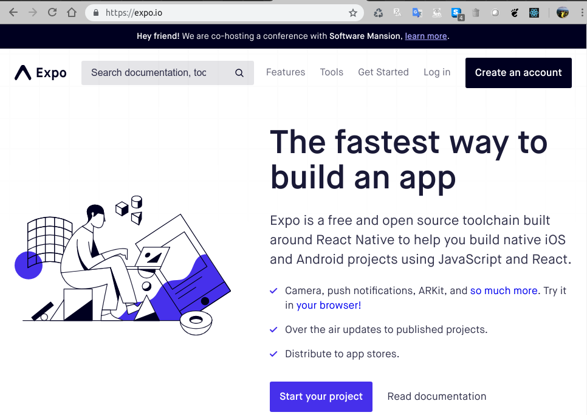
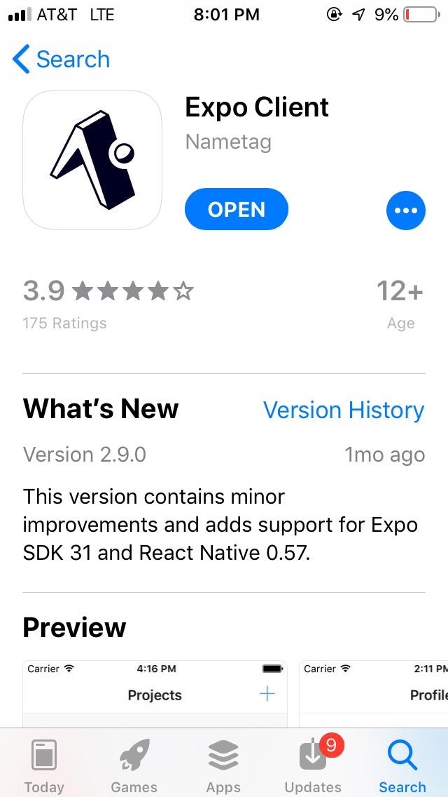
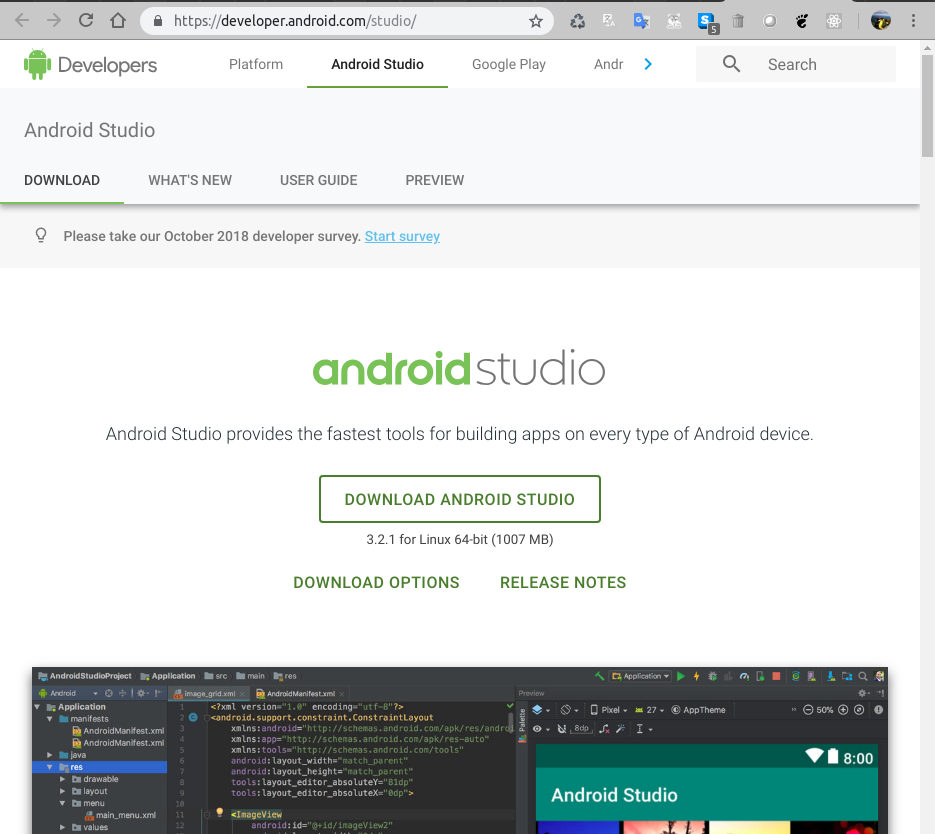
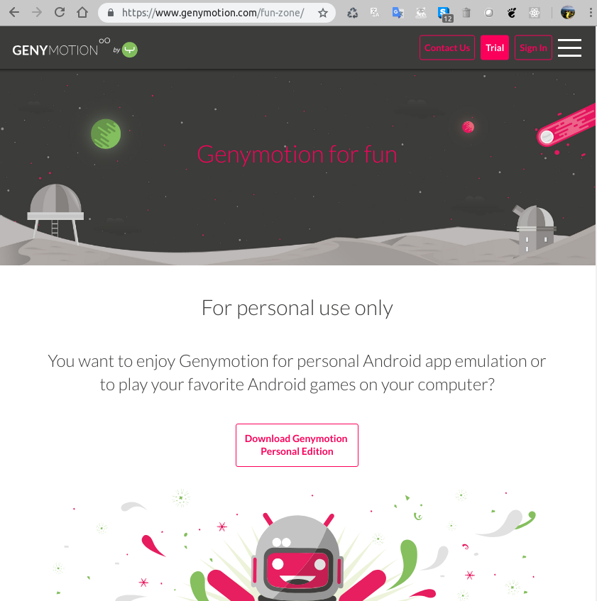
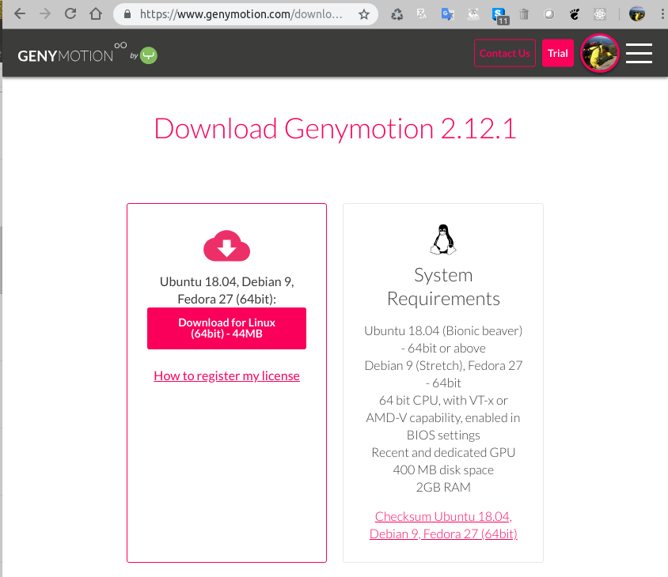
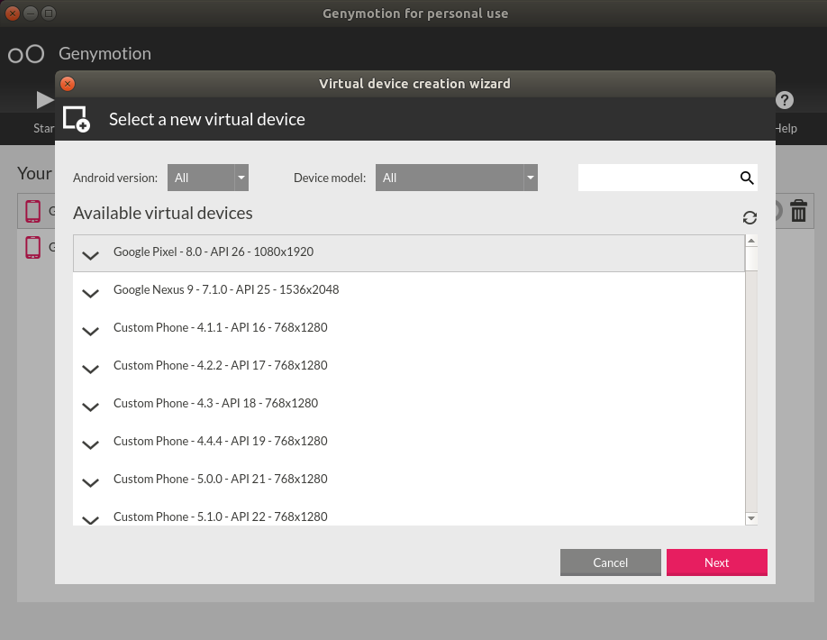
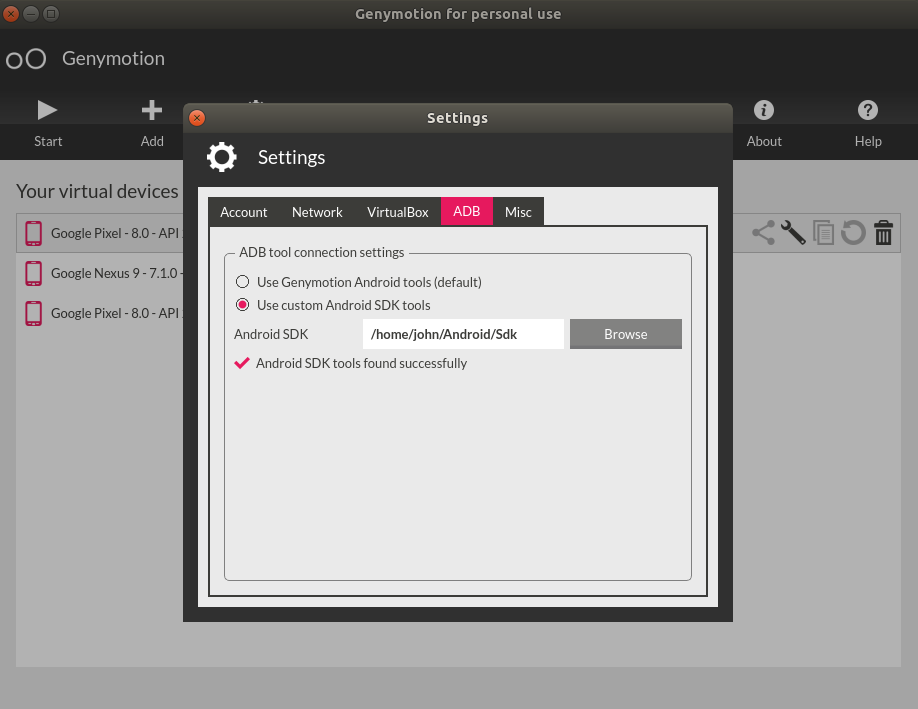
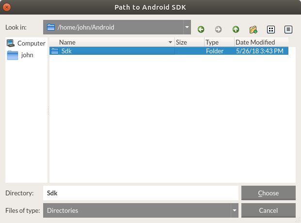

# Getting Setup on Linux:
These instructions were written for Ubuntu 18.x

## Install the Expo App on Your Phone
One reason Expo is such a great development environment is that it makes it easy to run and debug your mobile right on your phone. The Expo phone app makes that super easy.  The app requires a free Expo account.  Head over to the Expo web-site and  sign up for a free account.

1. Go to http://expo.io and click the "Create an account" button.

    

2. Install the Expo Client app on your phone. Search for it in your app store and install it.  It's free!

   

3. Launch the app and sign in using your Expo credentials. Your app in now linked to your account.


## Install Node with NVM on Your Computer
The best way to install Node is with Node Version Manger (NVM). NVM allows you easily upgrade and switch between versions of Node.

1. Download the NVM install script with this command:
    ```bash
    curl -sL https://raw.githubusercontent.com/creationix/nvm/v0.33.11/install.sh -o install_nvm.sh
    ```

2. Install NVM by running this command
    ```bash
    bash install_nvm.sh
    ```

    It will install the software into a subdirectory of your home directory at ~/.nvm. It will also add the necessary lines to your ~/.profile file to use the file.

    To gain access to the nvm functionality, you'll need to either log out and log back in again or source the ~/.profile file so that your current session knows about the changes:
    ```bash
    source ~/.profile
    ```
git 
3. You can now list all the versions of Node available for installation:
    ```bash
    nvm ls-remote
    ```

4. Install the latest version by typing, I usually pick the latest version, but last stable version is always safe should be listed as 'Latest: LTS'
    ```
    nvm install < version number >
    ```


5. You can switch to any version you have by typing
    ```bash
    nvm use < version number >
    ```

6. To make a version your default, run this command:
    ```bash
    nvm alias < version number > default
    `````

7. You can check the version of node you're running at the time by typing:
    ```bash
    node -v
    `````

## Install and Configure Git
 
1. Run the following command to install Git
    ```bash
    sudo apt update
    sudo apt install git
    ```

2. Set your name and email in Git using the following commands in the terminal.
    ```
    git config --global user.name "YOUR NAME"
    git config --global user.email your.email@somecompany.com
    ```

## Install Python 2.7.15

We don't need Python to develop our apps, but it is required to publish our apps to the app store.

1. In the Command Prompt window, type the following and press Enter.
    ```bash
    python --version
    ```

2. If Python 2.7  is installed and in your path, then this command will show you the version number.
    `Python 2.7.15rc1.`

    Otherwise, you will see:

    `python: command not found.`

3. In this case, you need to install Python 2.7 with the following command:
    ```bash
    sudo apt install python-minimal
    ```

## Install Expo Development Tools
 
1. Install the expo development tools on your computer.
    ```bash
    npm install expo-cli --global
    ```

## Install Yarn    

You may be used to using npm to install node dependencies.  Expo recommends using Yarn.  It just works better with Expo.

1) In the terminal run 
    ```bash
    npm install -g yarn
    ```

## Install Firebase Tools

1. Before you can use the Firebase tools you'll need a free account. Go to the Firebase website, https://firebase.google.com, and click the "Sign In" button. You'll be given the options of signing in or creating a new account.

    

2. Now that you have a free Google Developers account install Firebase Tools:
    ```bash
    npm install -g firebase-tools
    ```

## Install Visual Studio Code

You can you use any old text editor to write your code, but we recommend  you use an IDE (Integrated Development Environment) that supports JavaScript.  It will make your life a lot easier.  Because it's free and works on Mac, Linux and Windows, and is pretty darn good we will be using Visual Studio Code for this course.

1. Download Visual Studio code by going to this website : https://code.visualstudio.com/download  Choose the .deb version and download it.

    

2. When the download is done, double-click the .deb file to open the file in the Ubuntu Software application. Then click the "install" button to start the installation process.

    


## Install Android Studio

We won't be using Android Studio but installing it gives us features we need to debug our app.

1. Install the 32-bit libraries needed to run Android Studio with this command:
    ```bash
    sudo apt-get install libc6:i386 libncurses5:i386 libstdc++6:i386 lib32z1 libbz2-1.0:i386
    ```

2. Go to this page:  https://developer.android.com/studio/  and click the link to "Download Android Studio"

    

3. Unpack the .zip file you downloaded to an appropriate location for your applications, such as within/usr/local/ for your user profile, or /opt/ for shared users.

4. To launch Android Studio, open a terminal, navigate to the android-studio/bin/ directory, and execute `studio.sh.`

5. Select whether you want to import previous Android Studio settings or not, then click OK.

6. The Android Studio Setup Wizard guides you through the rest of the setup, which includes downloading Android SDK components that are required for development.


## Install and Configure Genymotion

Genymotion is the easiest way to get an Android emulator up and running. With Expo, you can use your phone, but you're probably going to want to use an emulator.

1. Genymotion requires VirtualBox, a virtual machine engine from Oracle. Install it with this command:
    ```bash
    sudo apt install virtualbox
    ```

2. Go to the Genymotion "Fun-Zone" and create an account. You'll need to download the "free for personal use" version of Genymotion: https://www.genymotion.com/fun-zone/

    

3. Once you have your account, go back to the website and download the "with VirtualBox" version. If you install the "without VirtualBox" version you'll need to install VirtualBox separately.

    

4. Open a terminal and navigate to the file you just downloaded. Make it executable with the following command:
    ```bash
    chmod +x ./genymotion-2.12.2-linux_x64.bin
    ```

5. Do a local installation with following command:
    ```bash
    ./genymotion-2.12.2-linux_x64.bin
    ```

6. Launch Genymotion by running:
    ```bash
    genymotion/genymotion
    ```

7. Download a virtual device by clicking the "+ Add" button, selecting a virtual device (Google Pixel is good choice)  and then clicking the "Next" button. You'll be prompted to rename the device if you so choose.

    


8. After your new virtual device is finished installing, configure the ADB (Android Debugging Bridge)  in Genymotion to use the same SDK library as Android Studio. Click the "Settings" button on the main Genymotion screen and then click the "ADB" tab.

    

9. Select the "Use custom Android SDK tools" and then browse the Android Sdk folder. The path (if you installed android studio locally) will be '/home/<your username>/Android/Sdk'. Choose this folder and click the "choose" button.

    


10. Test your installation by choosing the virtual device you just installed and click the "Start" button. Your emulator should start.

    


