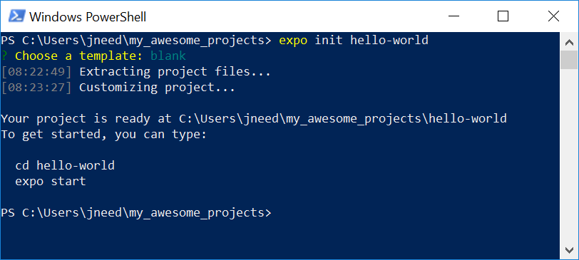
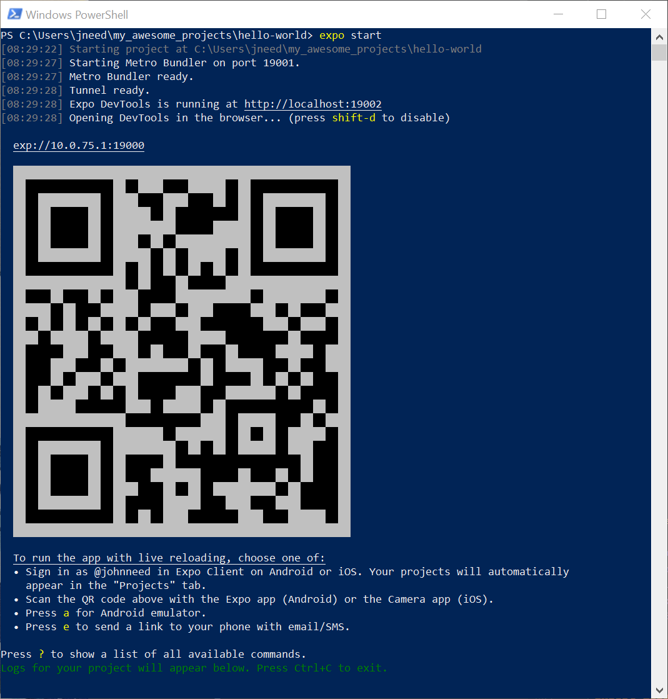
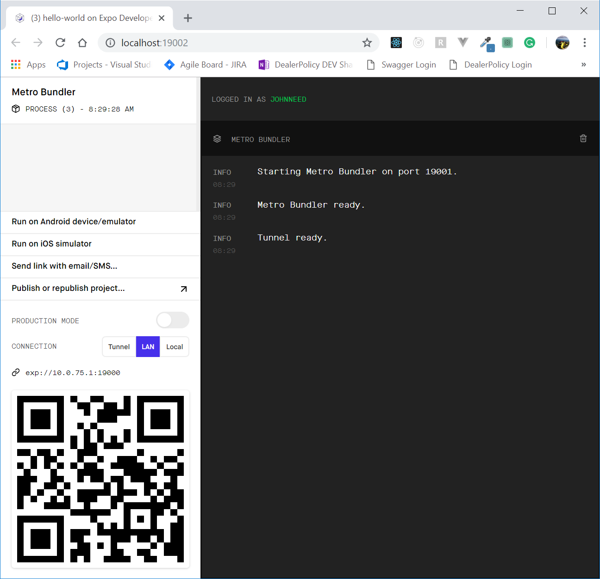

## Creating a Basic App With Expo

Start by opening a terminal. Then create a folder where you want to keep your projects. I'm calling my project directory "my_awesome_projects"


Navigate into your projects folder and execute this command

```
expo init hello-world
```

You should be prompted to "Choose a template.


"Hello World" is a super simple app, so we won't need tab-navigation. Hit 'enter' to accept the default template, 'blank.'  Expo will now extract the files you need and setup your app.  




After everything is done installing, Expo will give you instructions on how to start your app.  Type these two commands:

    cd hello-world
    expo start

When you start your app, the Expo Dev tools are automatically started in two different locations: in the terminal, and in the Chrome browser.  They function pretty much the same; the difference is mainly whether you prefer a web-based or terminal-based experience.

*Dev Tools via the Terminal* After you run `expo start`, your terminal should display a QR code and some information for some additional options.  These are the Expo Dev Tools.



*Dev Tools via Chrome* After starting your app in the terminal, you should also see a new tab open in Chrome.  These are the same Dev Tools that appear in the terminal. You can toggle the Expo Chrome dev tools by pressing 'd' in the Expo terminal.  Using the tools in the browser or the terminal is simply a matter of preference.




 

