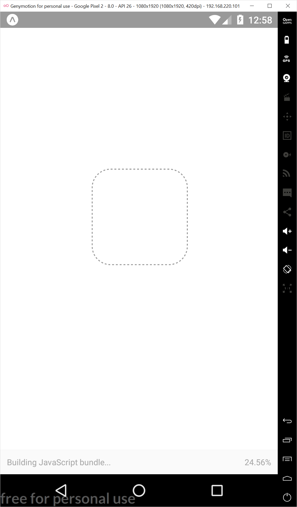

# Running on an Android Emulator

Now that we have an app, Lets see what it looks like on our Android Emulator.

Open Genymotion and start a virtual device.  After your virtual device finishes booting up, type 'a' in the Expo terminal window to launch your app in the emulator.  Alternatively, you can click the "Run on Android device/emulator" button in the Chrome Dev Tools windows

The first time you launch your app in an emulator Expo will install the Expo client.  When this is finished you will be prompted to 'Allow display over other apps.'  Set the toggle to 'on' then return to your app by clicking the back button .

 

 You should now see your new app's splash screen as your app builds and downloads.

 

When you app is ready, you should see the new default view.

 

## Editing Your "Hello World" App

Now that we have a working app, let's change it to display "Hello World."  Launch Visual Studio Code and open your project folder.  Click `File => Open` Folder.  Then select your project folder.   In the Explorer panel on the left, Expand "HELLO-WORLD" and then select the App.js file.


Change the line 

`<Text>Open up App.js to start working on your app!</Text>` 

to 

`<Text>Hello WOrld</Text>` 

Your App.js file should now look like this:

```
    import React from 'react';
    import { StyleSheet, Text, View } from 'react-native';

    export default class App extends React.Component {
     render() {
       return (
         <View style={styles.container}>
           <Text>Hello World</Text>
         </View>
       );
     }
    }

    const styles = StyleSheet.create({
     container: {
       flex: 1,
       backgroundColor: '#fff',
       alignItems: 'center',
       justifyContent: 'center',
     },
    });
```

After you save the file, the app should rebuild and reload automagically.  Here's what you should see.


Congratulations, you've just built your first React Native Mobile app using Expo.
