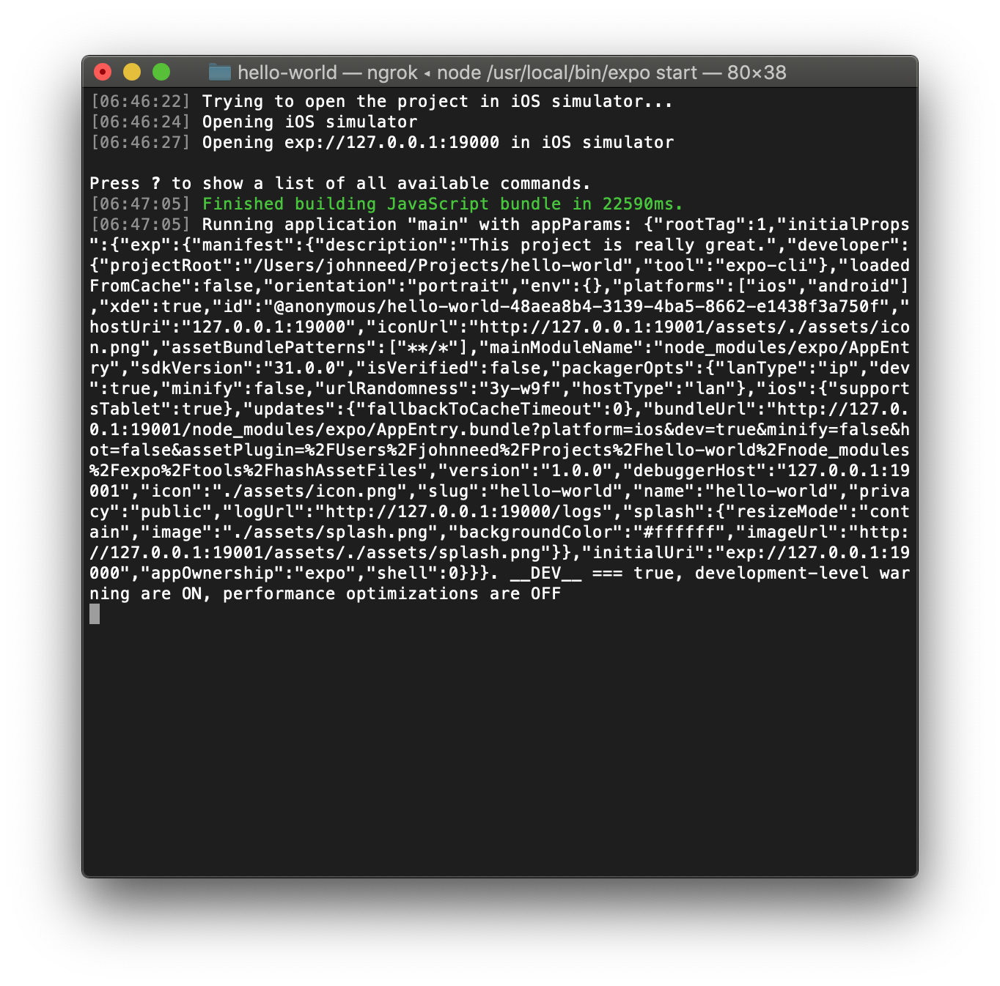
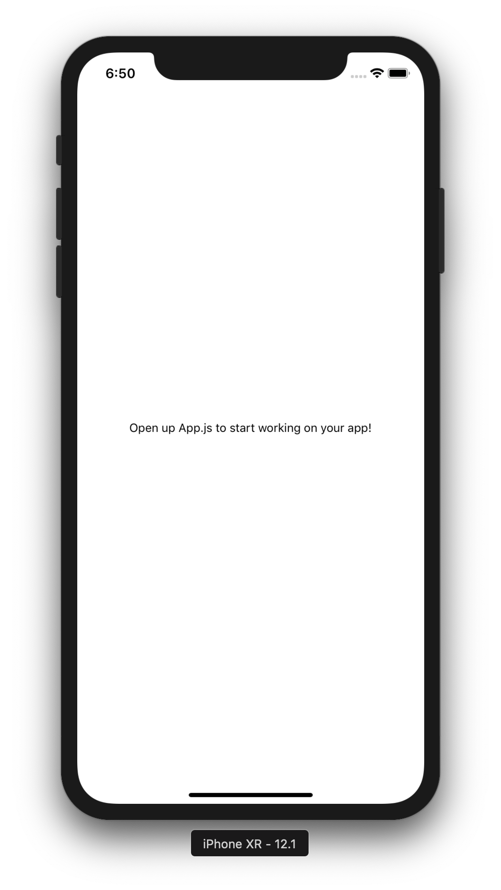
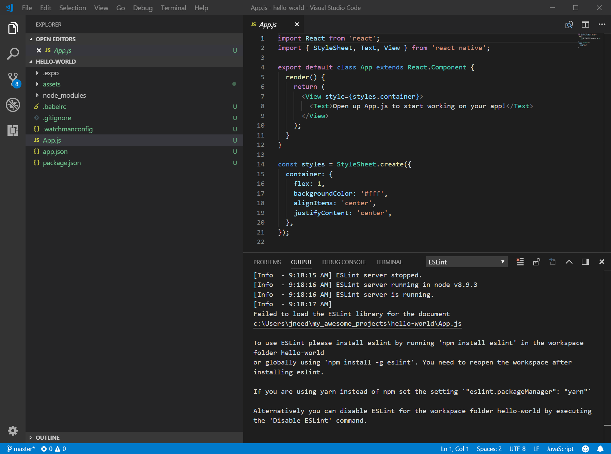
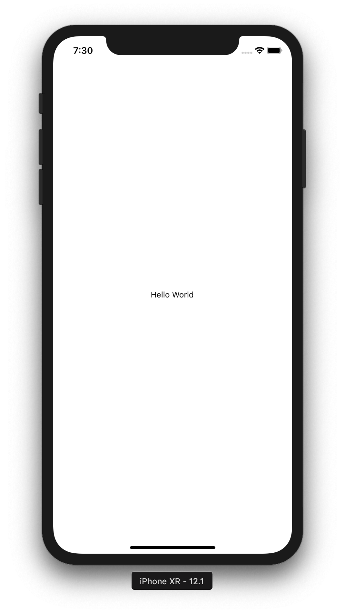

# Running on an iOS Emulator

If you're coding on a Mac with Xcode installed, you have the option to view and debug your app using the iOS Emulator.

Open your app in the iOS emulator by typing "i" in the terminal where you launch the app.  Alternatively you can click the "Run on iOS Simulator" button on Expo's dev tools in Chrome.

Expo will open the simulator and will install the Expo client if this is the first time you've launched Expo in iOS.   

 

 You should now see your new app's splash screen as your app builds and downloads. When you app is ready, you should see the new default view.




## Editing Your "Hello World" App

Now that we have a working app, let's change it to display "Hello World."  Launch Visual Studio Code and open your project folder.  Click `File => Open`.  Then select your project folder.   In the Explorer panel on the left, Expand "HELLO-WORLD" and then select the App.js file.



Change the line 

`<Text>Open up App.js to start working on your app!</Text>` 

to 

`<Text>Hello WOrld</Text>` 

Your App.js file should now look like this:

```
    import React from 'react';
    import { StyleSheet, Text, View } from 'react-native';

    export default class App extends React.Component {
     render() {
       return (
         <View style={styles.container}>
           <Text>Hello World</Text>
         </View>
       );
     }
    }

    const styles = StyleSheet.create({
     container: {
       flex: 1,
       backgroundColor: '#fff',
       alignItems: 'center',
       justifyContent: 'center',
     },
    });
```

After you save the file, the app should rebuild and reload automagically.  Here's what you should see.





Congratulations, you've just built your first React Native Mobile app using Expo and iOS Simulator.
 