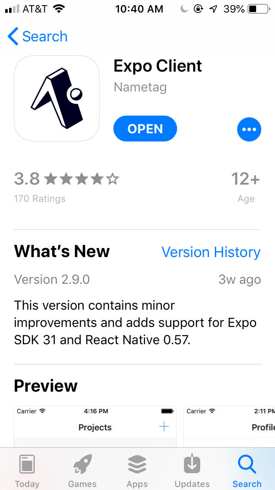
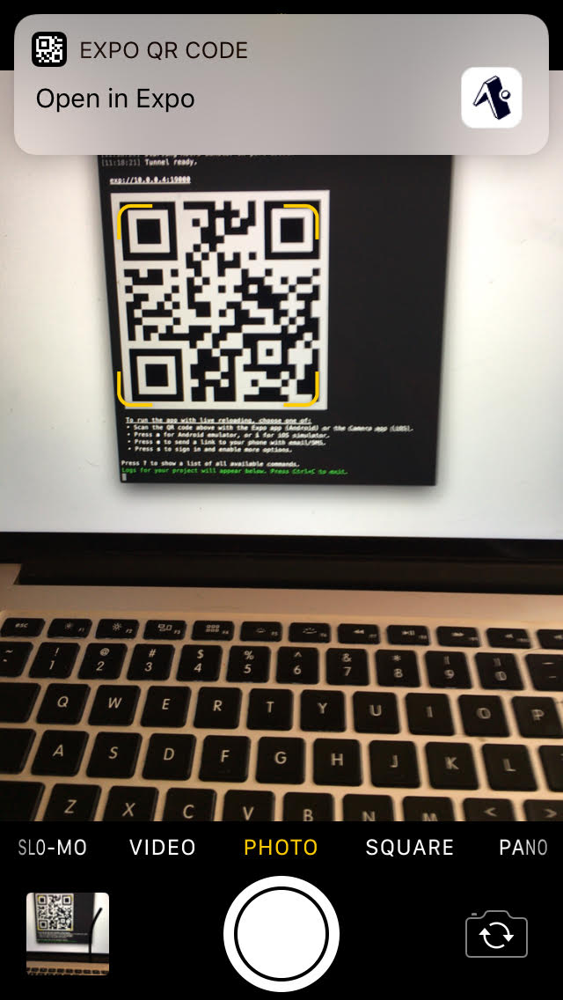

# Running on Your Mobile Device

Emulators are great, but nothing emulates your phone better than your phone.  

## Install Expo on your phone. 

If you haven't done so already, go to your app store and install the Expo app. Expo runs on the iPhone and Android, and it's free.



Next you should launch Expo on your phone and sign in using your Expo credentials.  

## Launch the App on Your Phone

Once you've installed the expo mobile app, you have three options for launching your new app: 
 
- SMS
- Email 
- UPC (aka "QR Code" - usually the easiest option)
  
To send a link to your phone via SMS or Email, press 'e' in your Expo terminal or click the 'Send Link with Email/SMS' button on the Expo Dev Tools in Chrome.  Enter your phone number or email address and you should receive a message with a link that will launch your app.
  
Alternatively you can connect by scanning the UPC symbol in the terminal or dev tools window.  If you're using an Android device, using the Expo app to scan the UPC.   If you're on iPhone, use the built-in camera app to scan the UPC,  you'll be prompted to open the recieved link in Expo.



You should now see your new app's splash screen as your app builds and downloads. When you app is ready, you should see the new default view.

**Note**: If you're having issues connecting, make sure your phone is connected to the same wifi network as your computer.   If can't do that or there are firewall issues, try switching the connection type from 'LAN' to "Tunnel."  The switch is located on the Dev Tools window

## Editing Your "Hello World" App

Now that we have a working app, let's change it to display "Hello World."  Launch Visual Studio Code and open your project folder.  Click `File => Open`.  Then select your project folder.   In the Explorer panel on the left, Expand "HELLO-WORLD" and then select the App.js file.

Change the line:

`<Text>Open up App.js to start working on your app!</Text>` 

to this: 

`<Text>Hello WOrld</Text>` 

Your App.js file should now look like this:

```
    import React from 'react';
    import { StyleSheet, Text, View } from 'react-native';

    export default class App extends React.Component {
     render() {
       return (
         <View style={styles.container}>
           <Text>Hello World</Text>
         </View>
       );
     }
    }

    const styles = StyleSheet.create({
     container: {
       flex: 1,
       backgroundColor: '#fff',
       alignItems: 'center',
       justifyContent: 'center',
     },
    });
```

After you save the file, the app should rebuild and reload automagically.  Here's what you should see.


Congratulations, you've just built your first React Native Mobile app using Expo and iOS Simulator.
 