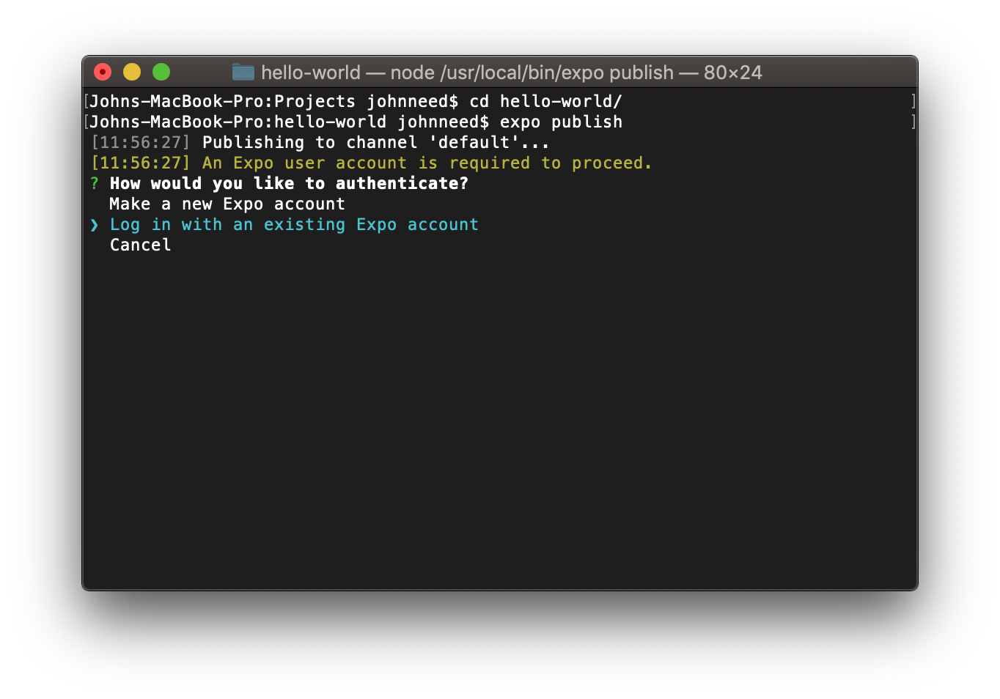
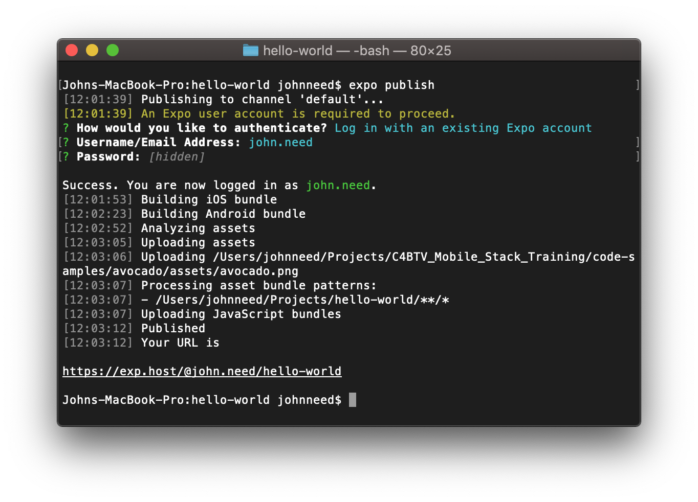
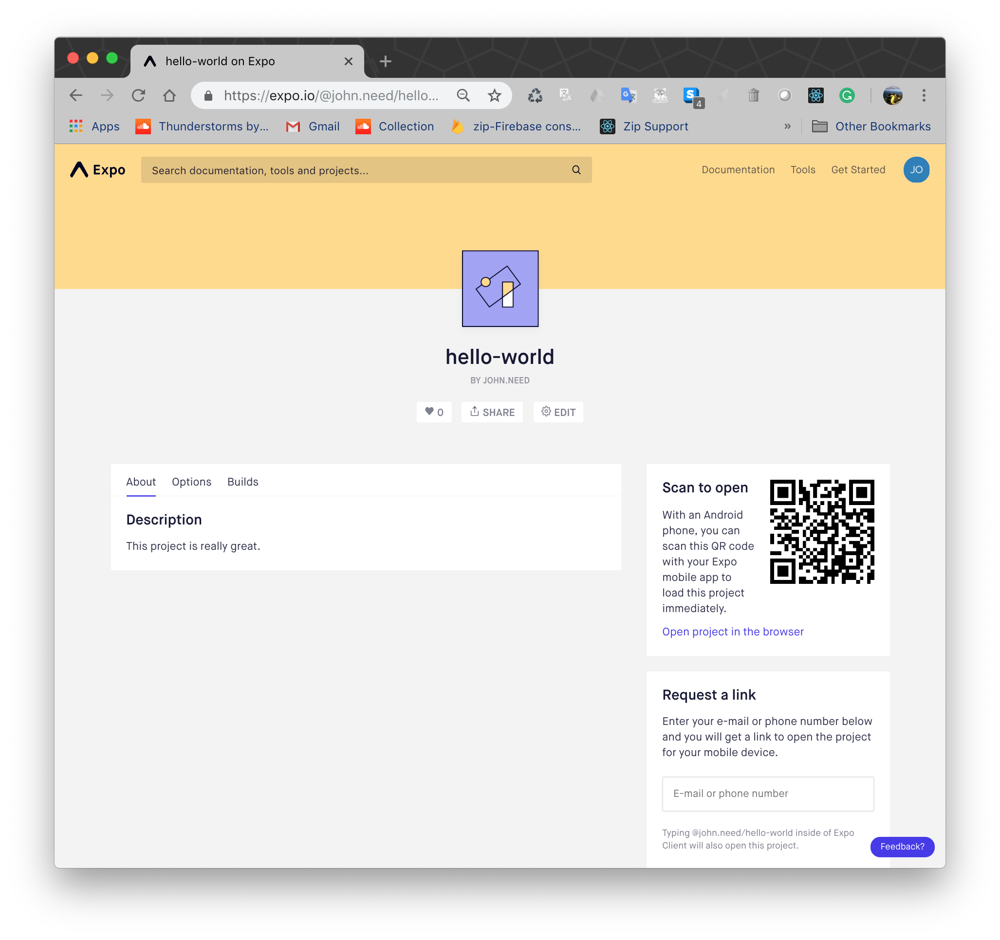

# Publishing to Expo

Being able to run the app on your phone is a great feature of Expo.  But if you want run it on your phone when your computer's turned off?  Don't fret, You can host your new app on Expo's servers.   If you haven't already, you'll need to create a free account on Expo.io 

To publish your app, open a a terminal and cd into the root of your project.   Then exectue the command

```bash
  expo publish
```

You may be prompted to login. You should aleady have an account so choose `Log in with an existing Expo account`  
 

Enter your username and password to continue.  Expo will build an iOS and Android version of your app and upload them to the Expo servers.
 


To access your app, open the URL that appears at the end of the publishing process.  You should be taken to the page for your app.  To launch your app, scan the UPC symbol like you normally would or use the "Request a link" box to send yourself a link.  The app will open in Expo.  
The Expo app will save the link so you only need to visit this page once.  Afterwards, you only need to open the Expo app and click the link to your app to access it.
 
 

