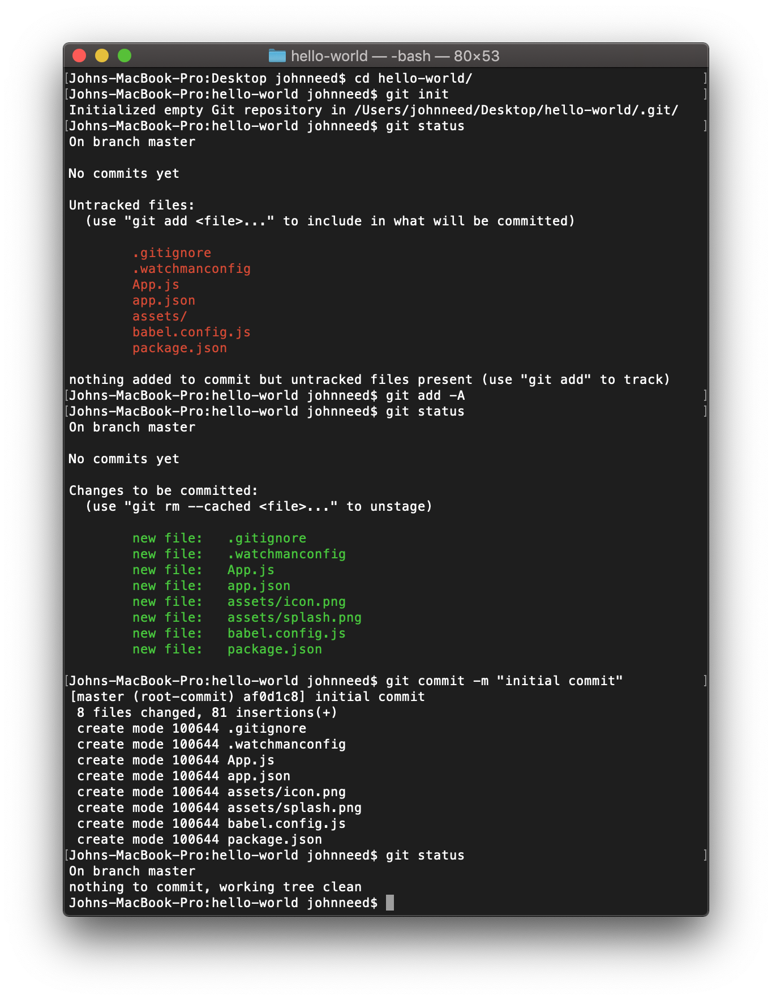
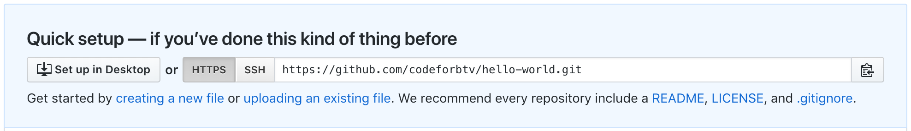

## Creating a New Repository

Now that you have your new app, let's save your code, in case something bad happens to your computer.  It's also the best way to share your awesome code with your adoring fans.

To create a new Git repository open a terminal, cd into the root of your project, and initialize your new repository with this command:

```bash
cd hello-world
git init
```

Now check the status of your respository

```bash
git status
```

You should see a list of 'untracked filed.' Let's add these file to git so they can be tracked.  The '-A' means 'add all changes'

```bash
git add -A
```

Execute the `git status` command again.  You should see a list of files with 'changes to be committed'.  Every commit requires a message.  Commit your changes with the message 'initial commit' using this command:

```bash
git commit -m 'initial commit'
```

Execute `git status` one more time.  You should the message 'nothing to commit, working tree clean.'


Here's what it looks like in the terminal:



You now have all your files saved in source control.  Unfortunately the repository only exists on your machine.  Let's save that repository on GitHub so you can share it with your fans.  To do this you'll need to open Chrome, go to [github.com](https://github.com/), and log in.
After you log in find and click the green "New" button.


That link should take you to the New Repository form. Give the repository the same name as your project. Make sure you leave the "Initialize new repository with a README" checkbox **unchecked**.  CLick "Create Repository."


After your GitHub repository is created you will need the repository's URL to connect to the one on your computer.  Click the little "copy to clipboard button" to copy the url.




Switch back to the terminal and issue the following commands, substituting your URL.

```bash 
git remote add origin https://github.com/codeforbtv/hello-world.git
git push -u origin master
```

Congratulations you now have a GitHub repository.  Paste the URL into your browser and you should see your code uploaded to GitHub.

