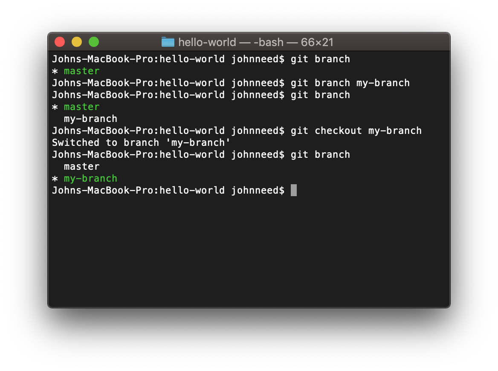

## Branching

If you are the only developer working on a project, you already know all the Git you need to maintain your code.  Fortunately you are going to be building an app so awesome other developers will want to help you out.  When working with a team, it's important to follow best practices.  
The first rule in playing well with other is to keep your code separate from your teammates'.  Git makes this easy for you by way of branches.  A branch is your own copy of the code.  Every developer gets their own copy so no one stomps on another developer's code.

To list all the current branches execute the command `git branch`.  At this point you should only have one branch, 'master'  

Master branch is one branch you should never work on.  Before you do anything, create your own branch and do all your work there.  Let's create your own branch by executing the following command.

```bash
git branch my-branch
```

You now have your own branch.  Verify this by executing `git branch` again.  You should see that while 'my-branch' exits, you're still using 'master.'  Switch to your new branch with this command.


```bash
git checkout my-branch
```

Try `git branch` one more time and you should see you are now using 'my-branch.'  Here's what it should look like in the terminal:




