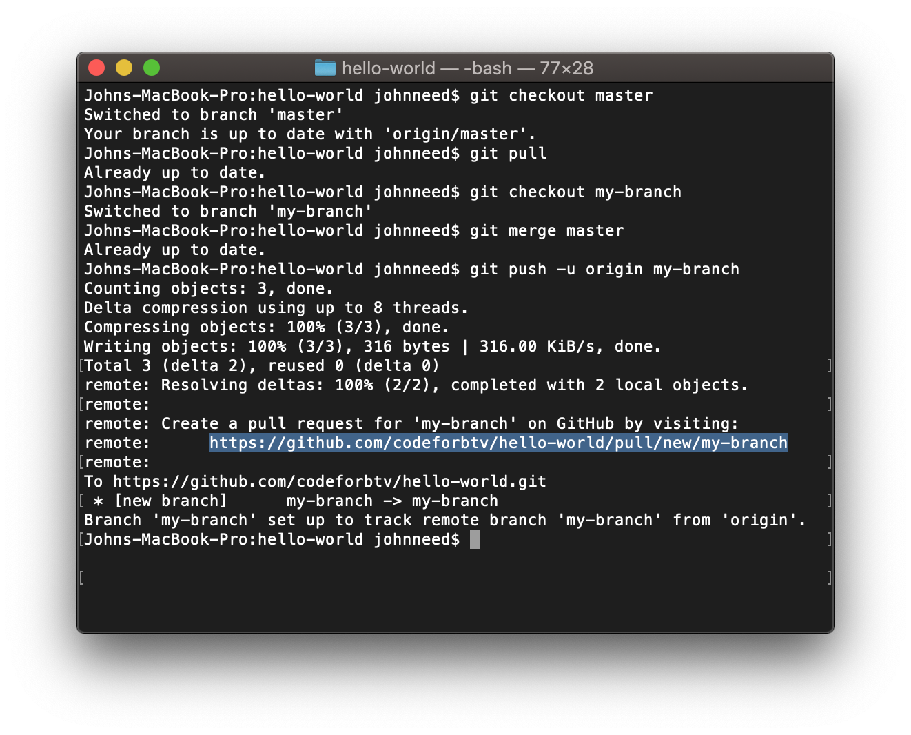
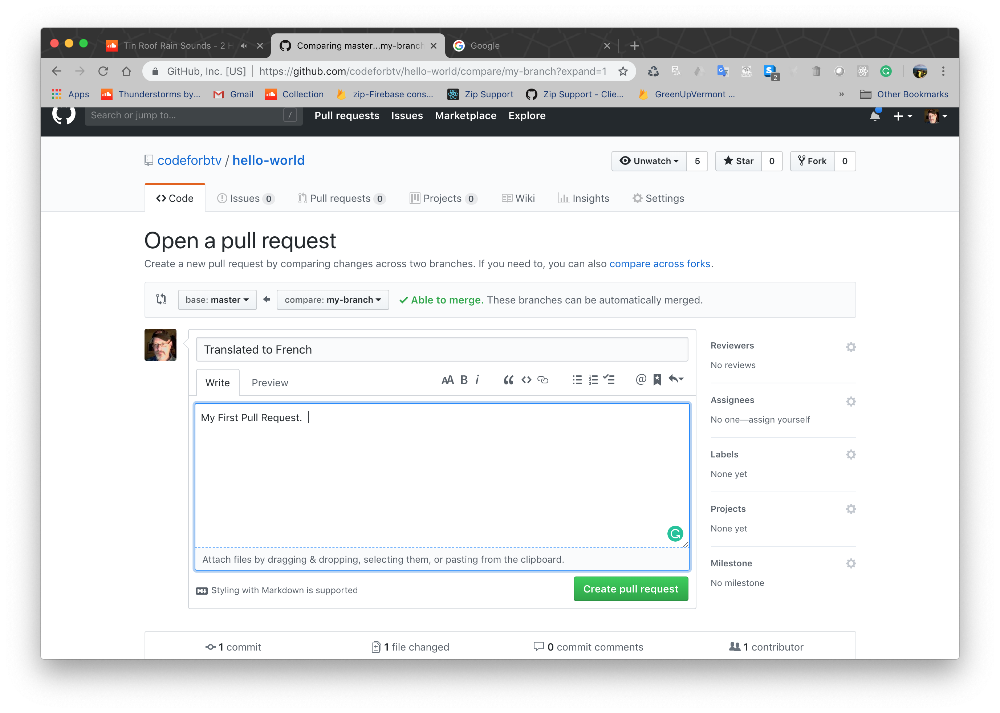
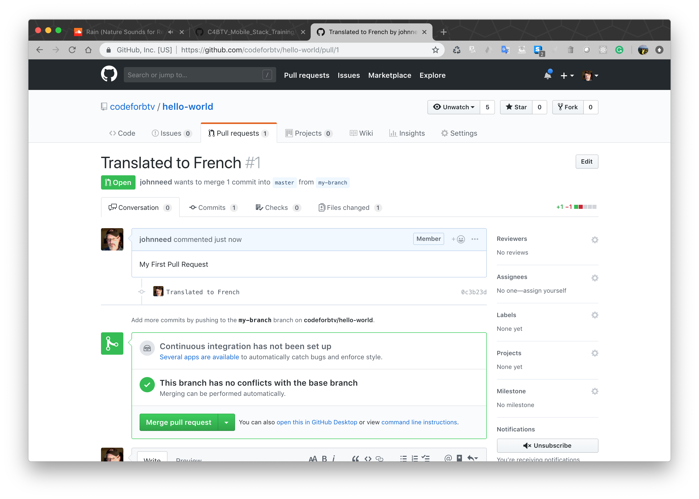

## Submitting Code

Before you synch up your local repository with GitHub you'll want to merge changes from other developers first. It's considered common courtesy to handle potential merge conflicts on your computer.  You should fix your problems before sharing your code with the team.  

New, officially-approved code will come down via the master branch, which means we'll need to switch back to master first.

```bash
git checkout master
```

Now pull the latest code from GitHub's master branch.

```bash
git pull
```

You probably don't have any changes to pull, but we'll pretend that you do.  If you did have changes, you would want to  merge those with your own changes.  To do that, wwitch back to your working branch.

```bash
git checkout my-branch
```

Now merge 'master' into 'my-branch'

```bash
git merge master
```

Now that 'my-branch' has all the latest you're ready to create a pull-request.  A pull-request is how you submit your code for review before it is merged back into master for everyone to share.

create a new branch on GitHub that is linked to your local working branch by executing the following command.

```bash
git push -u origin my-branch
```

This will create a new branch on GitHub and push your code up.   Naturally 'my-branch' should match whatever branch you're currently working on.  Git will provide you with a URL to view your branch on GitHub. You'll need to visit that URL to create a pull-request on GitHub.



On GitHub, add a description to your pull request and then click the 'Create Pull Request' button.  



You're code has now been submitted for review.  Once it's okay'd by a reviewer, your code will be merged into the master branch.  It's up to the repository owner to configure how many reviews are necessary before merging to master.



Congratulations you now know how to submit code to a project.


