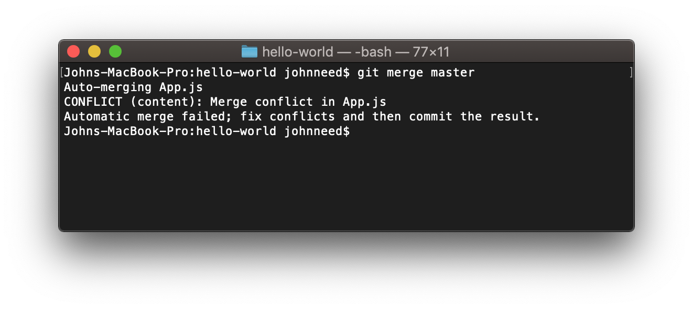
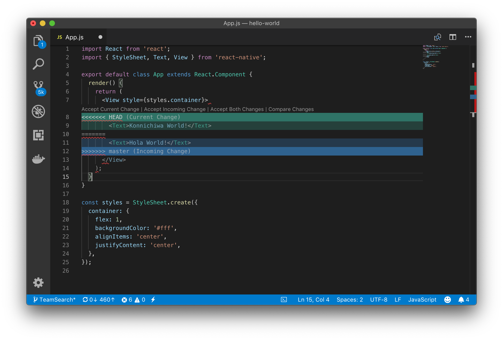

## Resolving Conflicts

Despite out best intentions, sometimes we make changes that can't be automatically merged.  If two developers edit the same line of code Git will require a manual resolution. 
When you pull code that conflicts with your own edits, Git will alert to which files needs resolving and mark the conflicts.


 


Open the offending file and you'll see that Git has modified it to include both sets of code.  Visual Studio Code understand what those tags mean and highlights the conflict for you.


 


Here's the conflict without the highlights.

```
<<<<<<< HEAD
        <Text>Konnichiwa World!</Text>
=======
        <Text>Hola World!</Text>
>>>>>>> master
```

The incoming code, the code that's already in the GitHub master branch starts after the `<<<<<<< HEAD` tag and ends at the `=======` tag.

Your code starts at the `=======` and ends at the `>>>>>>> master` tag.

It's up to you to remove these tags and decide which code should make it into your final merge.

When you're done,save the file, commit your changes and push the changes.