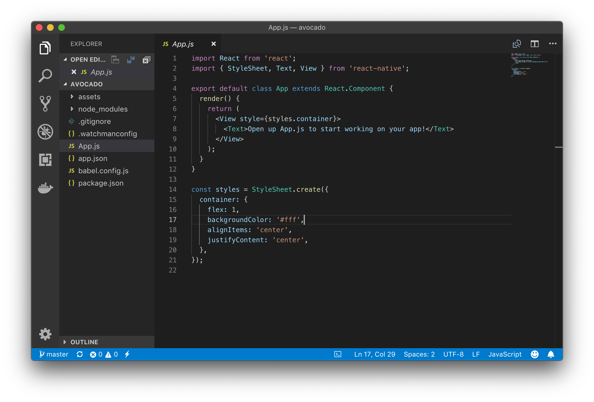

## Setting Up Our Project

This is a new app, so let's start from scratch.  

create a folder where you want to keep our code and then create a new app called avocado.

```bash
expo init avocado
```

Choose the 'blank' template when prompted.

Next, cd into the app and initialize a Git repository.

```bash
cd avocado
git init
```

We'll need three images for this app: the avocado, a splash screen, and a icon.  [You can download them here](../code-samples/avocado/assets/).  Drop them into you assets folder, replacing anything that's already there. 

Now go to GitHub and create a repository called "avocado."  Get the URL and issues the this command substituting our URL.

```bash
git add -A
git commit -m "first commit"
git remote add origin https://github.com/codeforbtv/avocado.git
git push -u origin master
``` 

Let's create a branch for our work:

```bash
git branch my-branch
git checkout my-branch
```

Woot! now that our project is setup, lets create an awesome app.

Start by launching the app, 

```bash
expo start
```

Open the app in our phone, or favorite emulator.  You should see this:


Now we're ready to start coding.  Launch Visual Studio Code, click File -> Open and select our avocado folder. Our Project should now appear in the Explorer window.  Open the App.js file.




Let's start by changing the text.  We only have one Text tag, but we'll need 3.  Change this:


    <Text>Open up App.js to start working on our app!</Text>


to this:

    <Text>I have eaten</Text>
    <Text>0</Text>
    <Text>Avocados</Text>

The render method should now look like this: 

 
    render() {
      return (
          <View style={styles.container}>
            <Text>I have eaten</Text>
            <Text>0</Text>
            <Text>Avocados</Text>
          </View>
      );
    }

Our app should now look like this:


