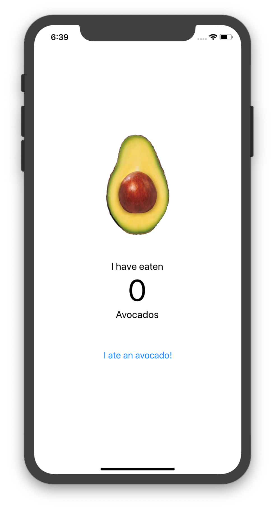

# Lesson Four: A Simple App

Hello World is an awesome app but it doesn't do much.  I like for my mobile apps to do stuff, so let's a build an app that counts how many avocados you eat during our lifetime.  That's useful, isn't it?

By the way, Here's where you can find [all the code for Avocado App](../code-samples/avocado).

   1. [View, Text and Button Components](01_Setting-Up-Our-Project.md)
   2. [Styling Components](03_Styling-Components.md)
   3. [React Props](03_Making-It-Prety-With-Styles.md)
   4. [React State](04_Making-Things-Do-Things-Props-And-State.md)

 
Here's the app you'll build running in the Android emulator.  

It's a simple app to track your avocado consumption. When you eat an avocado simply click the "I ate an avocado" button, and almost magically, the app will count how many avocados you've eaten. 

Now let's create our app.

