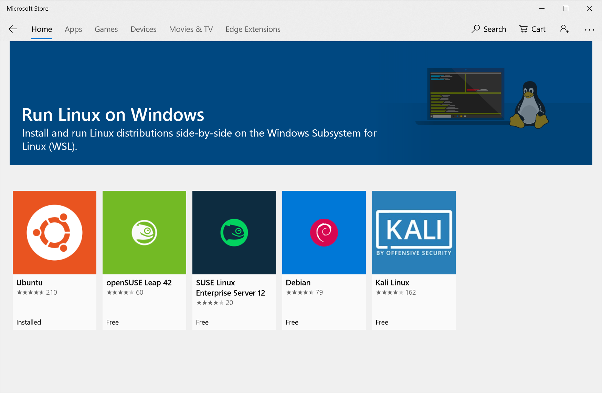
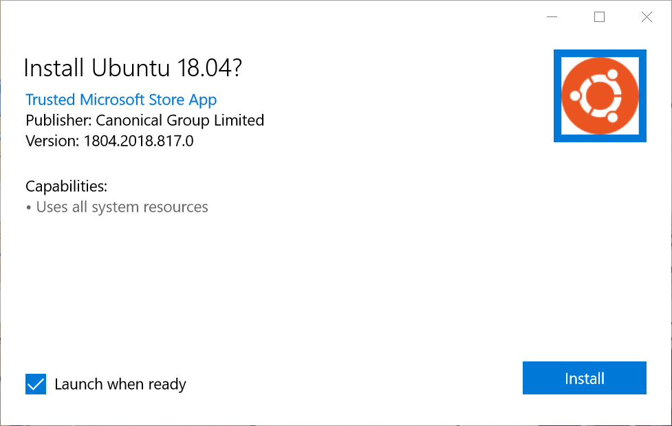

## Running Windows?
Windows users must **enable WSL** (Windows Subsystem for Linux). To do this, open a PowerShell terminal as an Administrator :

1) Click the Windows button in your task-bar.
2) Type `powershell`
3) Right-click the 'Windows PowerShell' icon and select 'Run as Administrator'
4) Choose 'Yes' when prompted to allow PowerShell to make changes to your sytem.

In the PowerShell window, run this command `Enable-WindowsOptionalFeature -Online -FeatureName Microsoft-Windows-Subsystem-Linux`

You will be promted to reboot your computer.

Now you need to install a Linux Distro.  You can do this three different ways:

### Install Linux via the Microsoft Store

1) CLIck the 'Windows' button in the task-bar and type 'store.'
2) Open the Microsoft Store and search for 'Linux.'
3) Select a distro. (We recommend Ubuntu)

    
    
### Or Install Linux via PowerShell

1) Open PowerShell
2) Run `Invoke-WebRequest -Uri https://aka.ms/wsl-ubuntu-1604 -OutFile Ubuntu.appx -UseBasicParsing`

### Or Install Linux manually

1) Click [here](https://aka.ms/wsl-ubuntu-1804) to download the Ubuntu app.
2) Double-click the download.
3) You will be prompted to install Ubuntu 18.04
 
 
 