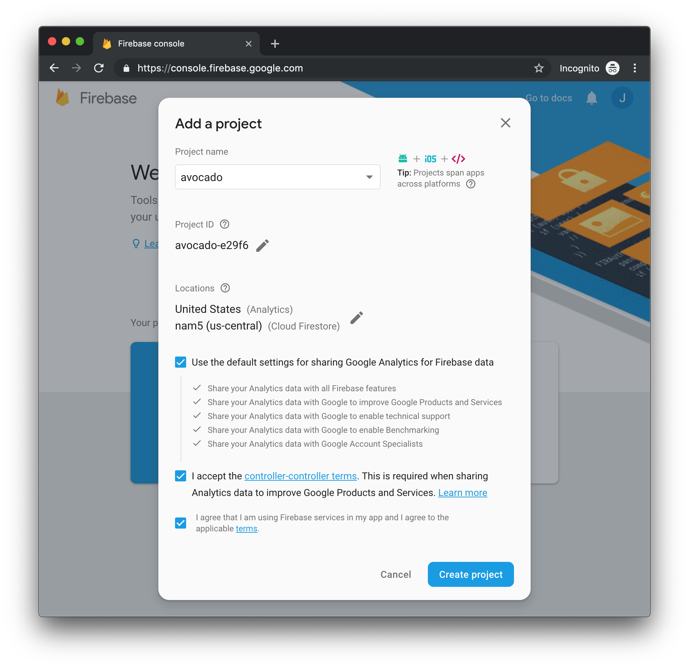
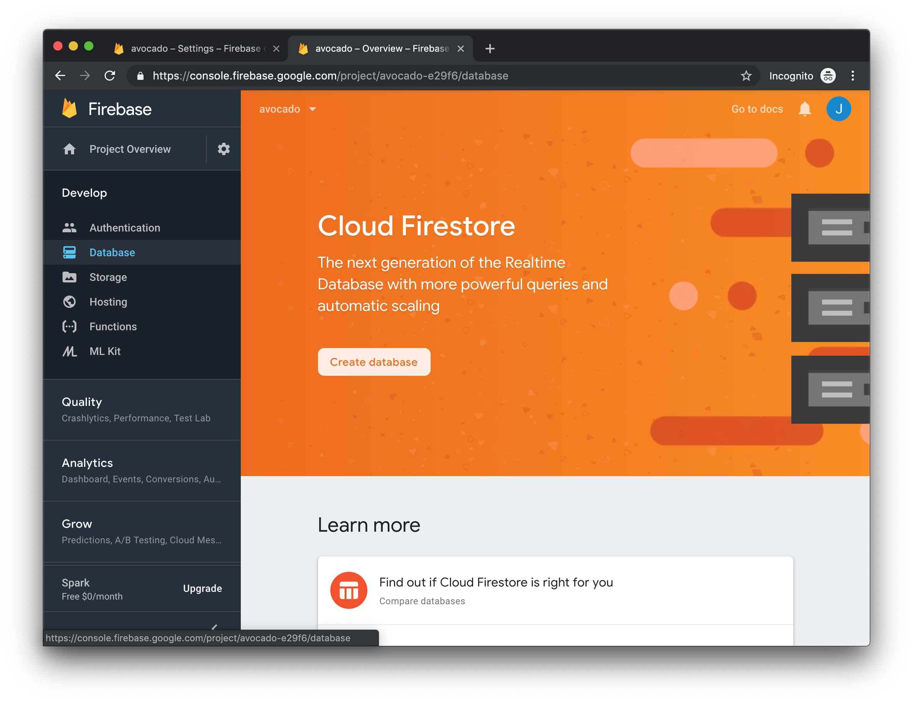
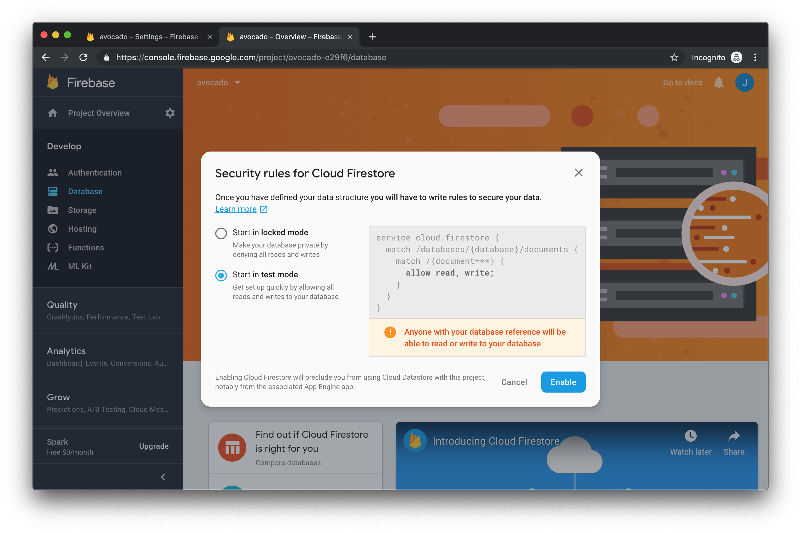
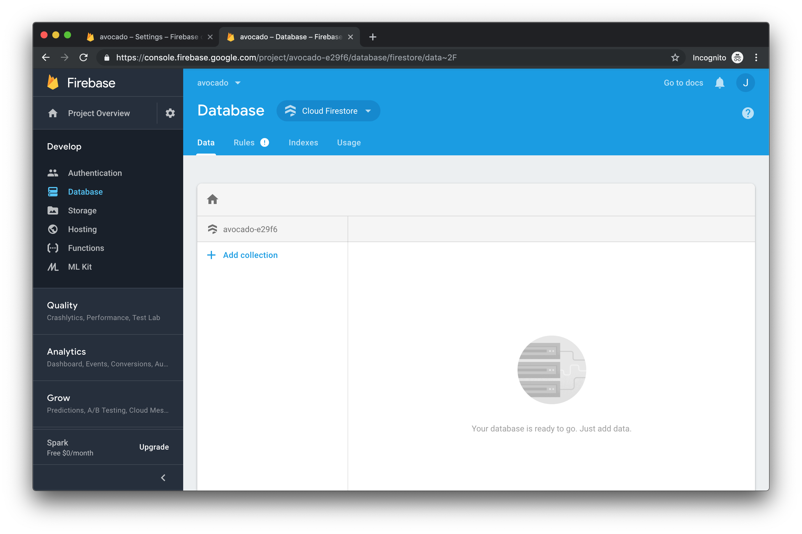

# Getting Started with Firebase

To get started, go to [Firebase Console](https://console.firebase.google.com ) and click the "Sign In" button,  You'll need a free Google Account.  If you don't have one, you'll see a handy link for creating one. Once you're logged in, click the big "Add Project" button.

![Alt)(assets/01-welcome-to-firebase.png "screenshot -Welcome to Firebase")

Give your database name.  For this project enter 'avocado' because that's the app we're building. Select the first two checkboxes, if you're inclined to share your analytics data with Google.
Now, agree to the application terms by clicking the checkbox.  Finally click the "Create Project" button

Now we can add a database to our new project.   

1) In the left side-bar, click 'Develop' then click 'Database'
2) In the main panel on the right, click the 'Create Database' button.

Every good database needs some level of security. We're only developing right now so we'll turn the security off to avoid confusing permissions errors.  
1) Select the radio button marked "Start in test mode" 
2) Click the 'Enable' button.

That's it, we're all set.  You should now have an empty database to use with your app.

